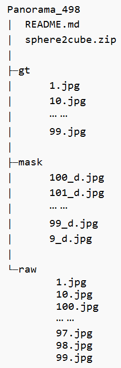

# Panorama_498全景图像数据集\*

Panorama_498数据集包含了大量四川省内各大景区的8K全景照片，可用于全景图像处理、图像超分、支架擦除等任务。

这些照片的拍摄和后期处理工作均由西南交通大学计算机与人工智能学院王红军团队完成，相关问题可通过email联系：cf20090901@outlook.com

[TOC]

## 数据集基本情况

本数据集的目录结构如下：

本数据集总共包含498组图像，三个文件夹中的相同编号的图像为一组。

raw文件夹包含的是**原始的拼接好的全景照片**，部分图像的分辨率为8640\*4320，还有部分为7680\*3840。

gt文件夹包含的是擦除了raw图像中的支架的全景图像，部分图像的分辨率为8640\*4320，还有部分为7680\*3840。

mask文件夹包含的是二进制掩膜图像，其意义是指示相机支架的位置。将原始全景图像进行六面体切割后，会产生6个映射图像，分别命名为前（u）、后（b）、左（l）、右（r）、上（u）、下（d），mask图像即指示了下（d）面图像中相机支架的位置。

## 图像切割合成工具

本数据集中包含一个图像切割合成工具，使用方法：

1. 把全景图切割为六面图：在系统中选中2:1全景图，把它拖动到”分成6面图.bat”中，将会自动生成6面图。

2. 把六面图合成为全景图：把六面图一起拖动到”合成全景图.bat”中，将会自动生成2:1全景图。**注意：六面图的名字必须包含”_l”, “_f”，等反映图片位置信息的名称，才可以正常合成。**

原始链接：[全景图/六面图互相转换工具 – KRPano技术解密](https://www.krpano.tech/archives/527/)

## 数据采集设备

我们采用了泰科易科技的360anywhere全景相机，型号为PF1360。其拥有前后左右4颗F2.4鱼眼镜头，支持10bit色彩深度，机内机外拼接的全景照片分率达到7680*3840。

更多详情可访问：https://www.teche720.com/index.html

## 下载链接

1. 百度网盘链接：https://pan.baidu.com/s/1nhDsAUk2m8Jnmjrw1XpH9Q 提取码：2845

2. 百度网盘二维码：

   

**\*Panorama_498全景图像数据集遵守GPL开源协议**

**希望能给有需要的团队提供帮助。**

